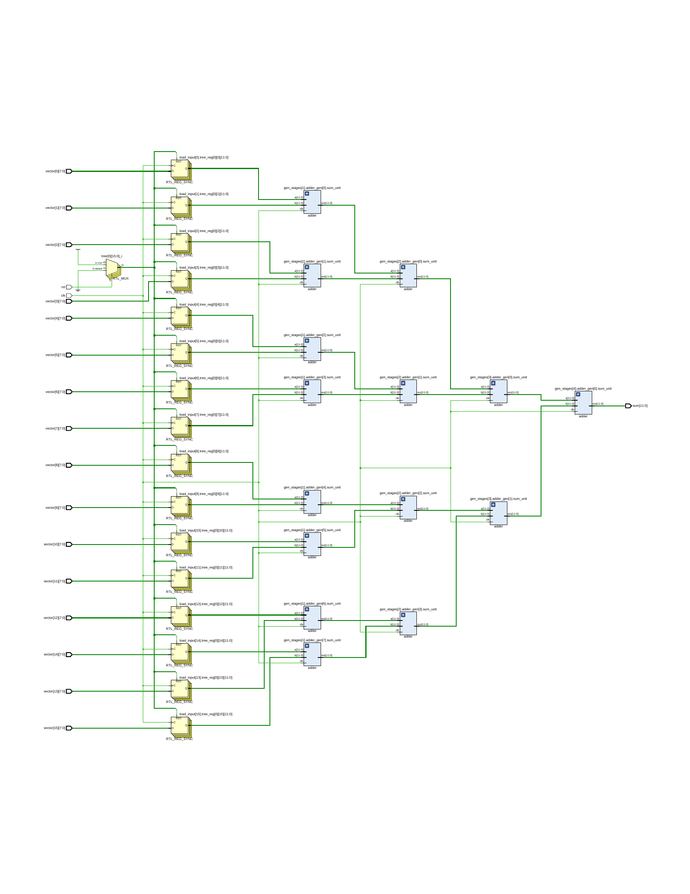
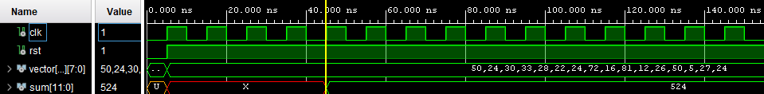

## Relatório: _Soma em VHDL usando For Generate_

### Objetivo
o objetivo desta atividade é implementar a operação de soma em VHDL utilizando o comando for generate, buscando a compreensão da estrutura sequencial e a comparação entre diferentes abordagens de implementação.

### Estrutura dos arquivos

```
📁 assets
├── rtl.pdf           # PDF gerado a partir do RTL do código principal
└── waveform.png      # Imagem da forma de onda (waveform) após a simulação/teste
📁 libs
├── custom
|   ├── custom.vhd         # Arquivo com definições de constantes e tipos auxiliares
|   └── custom_body.vhd    # Implementa a lógica da função log2(n)
├── adder.vhd              # Implementação de um somador binário de duas entradas
📄 sum_tree.vhd            # Módulo principal que implementa a lógica da árvore de somas
📄 tb_sum_tree.vhd         # Testbench para validar o funcionamento da árvore de somas
```

### Protótipo em Python
O código abaixo representa uma versão em alto nível da árvore de somas. Ele assume como entrada uma lista com tamanho igual a uma potência de dois e realiza somas em pares até restar um único valor (a soma total). Cada nível da árvore é armazenado, facilitando a visualização e depuração.

```python
def sum_tree(LSUM: list):
    nsums = len(LSUM)

    # Caso a lista esteja vazia, o resultado é zero
    if nsums == 0:
        return 0

    # Verifica se o tamanho da lista é uma potência de dois
    # A operação (n & (n-1)) == 0 só é verdadeira para potências de dois
    if (nsums & (nsums - 1)) != 0:
        raise ValueError("A lista de entrada deve ter tamanho igual a uma potência de dois.")

    # Inicializa a árvore com o primeiro nível (valores originais)
    tree = [LSUM.copy()]

    # Itera até que reste apenas um valor (a soma final)
    while len(tree[-1]) > 1:
        prev_level = tree[-1]  # Último nível da árvore
        next_level = []

        # Soma os elementos em pares e armazena no próximo nível
        for i in range(0, len(prev_level), 2):
            summed_value = prev_level[i] + prev_level[i + 1]
            next_level.append(summed_value)

        # Adiciona o novo nível à árvore
        tree.append(next_level)

    return tree  # Retorna a árvore completa, com todos os níveis de soma
```

### Resultados
Foi utilizado `N_SUM = 16` (quantidade de números a ser somado) e `N_WORD = 8` (tamanho dos números a ser somado), ambos podendo ser alterado no arquivo _custom.vhd_.

#### RTL
Após a implementação do módulo _sum_tree.vhd_ obteve-se o seguinte _RTL_:



Pode-se observar que a estrutura do _RTL_ se assemelha a uma árvore, o que era esperado a ser alcançado utilizando a estrutura de _for generate_.

#### Waveform
Após a implementação do módulo _tb_sum_tree.vhd_, obteve-se a seguinte _waveform_:



Pode-se observar que após a atribuição dos valores a serem somados, `[50, 24, 30, 33, 28, 22, 24, 72, 16, 81, 12, 26, 50, 5, 27, 24]`, levou-se exatamente `log2(N_SUM)` ciclos de clock para obter o resultado total das somas, `[524]`, sendo cada ciclo um _stage_ da árvore sendo somado.

### Considerações
A atividade proporcionou uma compreensão prática da modelagem de circuitos digitais usando VHDL, especialmente no que tange à abordagem iterativa com _for generate_. 

Além disso:
- O uso de _package_ e _body_ para organização do código foi consolidado;
  
- A implementação correspondeu corretamente ao protótipo em alto nível;
  
- Todos os testes passaram conforme o esperado, sem ocorrência de erros.